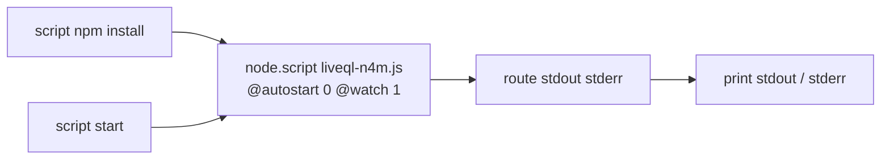

# node.script `.` Error in Max 9 (Live 12)

Date: 2026-03-20

## The Error

When loading `liveql.amxd` in Ableton Live 12 (Max 9), the Max console shows:

```
node.script: can't find file ..js
node.script: no connection to node process manager
```

## Root Cause

The device had two `node.script` objects:

1. **`node.script liveql-n4m.js @autostart 0 @watch 1`** — runs the GraphQL server. Works fine.
2. **`node.script .`** — inside a `p npm` subpatcher, used only for `script npm install`. Broken in Max 9.

In Max 8, `node.script .` treated `.` as a directory reference for npm operations. Max 9 rewrote argument resolution and now appends `.js` unconditionally, turning `.` into `..js`. The Max 9 release notes confirm related changes: a `.mjs` resolution fix in 9.0.3 [1] and a crash fix for "npm install with no js file" in 9.0.5 [2].

## Fix

Deleted the `p npm` subpatcher and wired "script npm install" directly to the main `node.script liveql-n4m.js` object. This works because `script npm install` runs npm in the same directory as the script's first argument [3], and `package.json` is co-located with `liveql-n4m.js`.



## Source Notes

1. Cycling '74 Max 9.0.3 Release Notes.
   https://cycling74.com/releases/max/9.0.3
2. Cycling '74 Max 9.0.5 Release Notes.
   https://cycling74.com/releases/max/9.0.5
3. Cycling '74 "Node for Max - Using npm".
   https://docs.cycling74.com/max8/vignettes/02_n4m_usingnpm
