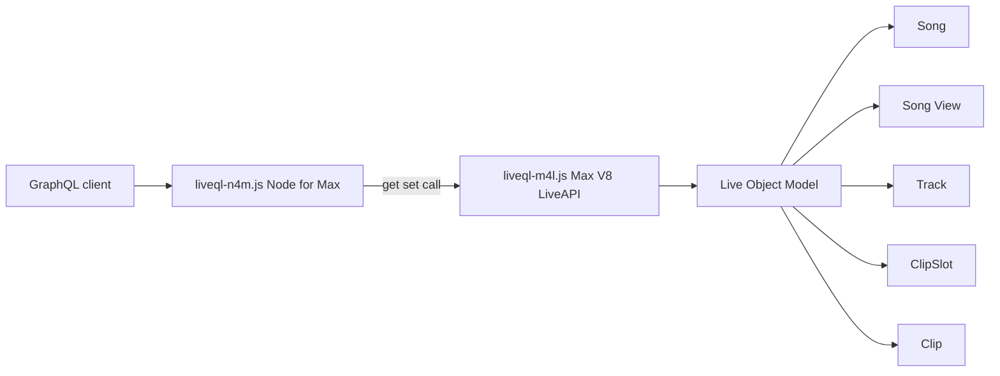
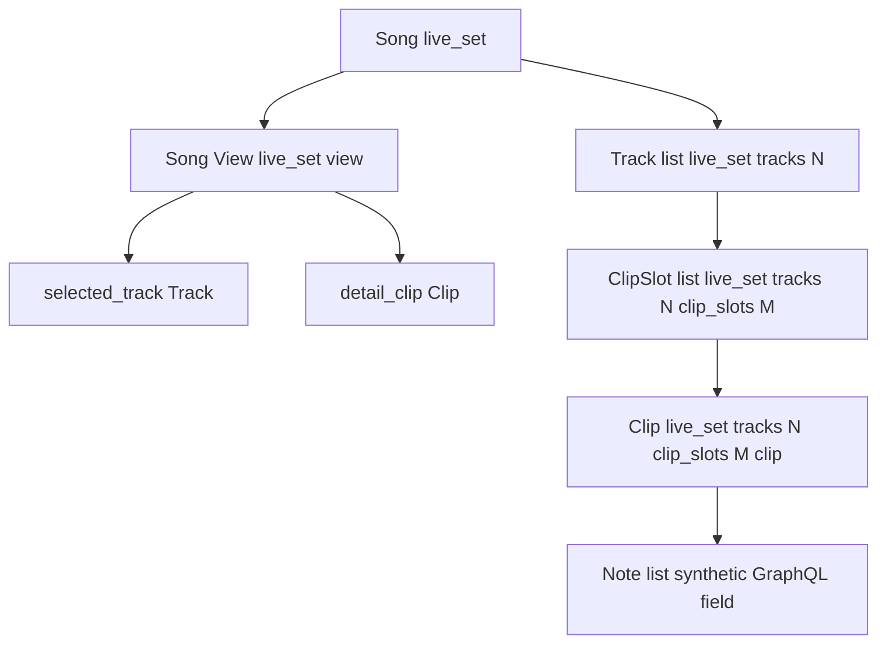
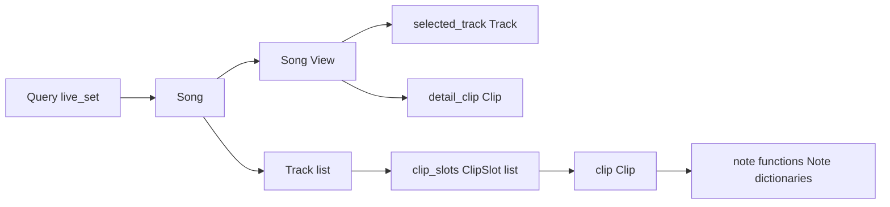

# Live API / LOM Research for `liveql-n4m.js`

Date: 2026-03-22

## Scope

This note focuses on the Live API and, especially, the Live Object Model (LOM) objects that are actually exposed by the GraphQL schema in `liveql-n4m.js`.

Primary sources:

- `https://docs.cycling74.com/userguide/m4l/live_api/`
- `https://docs.cycling74.com/apiref/lom/`
- `https://docs.cycling74.com/apiref/lom/song/`
- `https://docs.cycling74.com/apiref/lom/song_view/`
- `https://docs.cycling74.com/apiref/lom/track/`
- `https://docs.cycling74.com/apiref/lom/clipslot/`
- `https://docs.cycling74.com/apiref/lom/clip/`
- `https://docs.cycling74.com/apiref/js/liveapi/`

## Takeaways

- `liveql-n4m.js` exposes a very small, focused slice of the LOM: `Song`, `Song.View`, `Track`, `ClipSlot`, `Clip`, plus MIDI note dictionaries returned from clip note functions.
- The GraphQL schema mostly mirrors LOM children/properties directly, but `Clip.notes` is not a native LOM property. It is synthesized by calling `Clip.get_notes_extended`.
- Object identity in the Live API is split between stable canonical paths like `live_set tracks 0 clip_slots 1 clip` and dynamic runtime `id`s. The schema uses ids for follow-up reads/mutations.
- The important hierarchy for this project is: `Song -> Song.View / Track[] -> ClipSlot[] -> Clip`, with note editing and clip state changes hanging off `Clip` methods.

## How this code reaches the LOM

`liveql-n4m.js` does not talk to Ableton Live directly. It sends `get`, `set`, and `call` actions to `liveql-m4l.js`, which creates a Max `LiveAPI` object and performs the actual LOM operation.



Important runtime facts from the bridge:

- `getLive(idOrPath)` accepts either a canonical path string like `live_set` or a dynamic object id like `23`.
- The bridge returns `{ id, path, type }` internally, but GraphQL only exposes `id` and `path`.
- Child lists are fetched from `LiveAPI.get(child)` and stripped of the literal `"id"` tokens that Max returns.
- `LiveAPI` ids are runtime-only and should not be treated as stable across sessions.

## LOM hierarchy used by the schema



## Schema to LOM mapping

| GraphQL type/field | LOM object | LOM member kind | Canonical path or call | Notes |
| --- | --- | --- | --- | --- |
| `Query.live_set` | `Song` | root object | `live_set` | Entry point to the schema |
| `Song.is_playing` | `Song` | property | `is_playing` | Transport running state |
| `Song.view` | `Song` | child | `view` | Resolves to `Song.View` |
| `Song.tracks` | `Song` | child list | `tracks` | Returns visible regular tracks, not return/master tracks |
| `SongView.selected_track` | `Song.View` | child | `selected_track` | Track currently selected in Live UI |
| `SongView.detail_clip` | `Song.View` | child | `detail_clip` | Clip shown in Detail View |
| `Track.clip_slots` | `Track` | child list | `clip_slots` | Session View slots on a track |
| `Track.has_midi_input` | `Track` | property | `has_midi_input` | Useful track capability flag |
| `Track.name` | `Track` | property | `name` | Get/set supported in LOM |
| `ClipSlot.clip` | `ClipSlot` | child | `clip` | `id 0` if empty; schema maps that to `null` |
| `ClipSlot.has_clip` | `ClipSlot` | property | `has_clip` | Whether the slot currently contains a clip |
| `Clip.end_time` | `Clip` | property | `end_time` | Read-only/observe in LOM |
| `Clip.is_arrangement_clip` | `Clip` | property | `is_arrangement_clip` | Distinguishes session vs arrangement |
| `Clip.is_midi_clip` | `Clip` | property | `is_midi_clip` | Used to gate note access |
| `Clip.length` | `Clip` | property | `length` | Read-only in LOM |
| `Clip.looping` | `Clip` | property | `looping` | Get/set clip loop enabled state |
| `Clip.name` | `Clip` | property | `name` | Settable |
| `Clip.signature_denominator` | `Clip` | property | `signature_denominator` | Settable |
| `Clip.signature_numerator` | `Clip` | property | `signature_numerator` | Settable |
| `Clip.start_time` | `Clip` | property | `start_time` | Read-only/observe in LOM |
| `Clip.notes` | `Clip` | function-backed field | `get_notes_extended(...)` | Not a native LOM property |
| `Note.mute` | note dictionary field | dictionary key | `mute` | Comes from clip note dictionary APIs |
| `Mutation.song_start_playing` | `Song` | function | `start_playing()` | Returns refreshed `Song` |
| `Mutation.song_stop_playing` | `Song` | function | `stop_playing()` | Returns refreshed `Song` |
| `Mutation.track_set_name` | `Track` | property set | `set name ...` | LOM property write |
| `Mutation.clip_set_looping` | `Clip` | property set | `set looping ...` | Boolean mutation mapped to clip property write |
| `Mutation.clip_set_properties` | `Clip` | property set | `set name/signature_* ...` | Batched with `Promise.all` |
| `Mutation.clip_add_new_notes` | `Clip` | function | `add_new_notes(dict)` | MIDI clips only |
| `Mutation.clip_apply_note_modifications` | `Clip` | function | `apply_note_modifications(dict)` | MIDI clips only |
| `Mutation.clip_fire` | `Clip` | function | `fire()` | Fires the clip object itself |
| `Mutation.clip_get_notes_extended` | `Clip` | function | `get_notes_extended(...)` | Region query |
| `Mutation.clip_get_selected_notes_extended` | `Clip` | function | `get_selected_notes_extended()` | Selection query |
| `Mutation.clip_select_all_notes` | `Clip` | function | `select_all_notes()` | MIDI clips only |
| `Mutation.clip_remove_notes_by_id` | `Clip` | function | `remove_notes_by_id(...)` | MIDI clips only |
| `Mutation.clip_remove_notes_extended` | `Clip` | function | `remove_notes_extended(...)` | MIDI clips only |

## Object-by-object research

### 1. `Song`

- Canonical path: `live_set`
- GraphQL type: `Song`
- Used members in this repo:
  - child: `view`
  - child list: `tracks`
  - property: `is_playing`
  - functions: `start_playing`, `stop_playing`

What `Song` represents:

- The current Live Set.
- It is the natural root for traversal into tracks, scenes, return tracks, master track, view state, groove pool, and tuning system.

High-value LOM surface beyond the current schema:

- Children:
  - `scenes`
  - `return_tracks`
  - `master_track`
  - `groove_pool`
  - `tuning_system`
- Useful properties:
  - `tempo`
  - `current_song_time`
  - `loop`, `loop_start`, `loop_length`
  - `metronome`
  - `session_record`, `record_mode`, `overdub`
  - `signature_numerator`, `signature_denominator`
- Useful functions:
  - `stop_all_clips`
  - `create_scene`
  - `create_audio_track`, `create_midi_track`
  - `duplicate_track`, `delete_track`
  - `trigger_session_record`

Why it matters for this schema:

- `Song` is the only root query.
- Every current traversal starts from `live_set` and descends from there.

### 2. `Song.View`

- Canonical path: `live_set view`
- GraphQL type: `SongView`
- Used members in this repo:
  - child: `selected_track`
  - child: `detail_clip`

What `Song.View` represents:

- UI selection state and editor/view state for the open Live Set.
- This is how the schema accesses what the user has highlighted in Live.

Important nearby members not yet exposed:

- Children:
  - `highlighted_clip_slot`
  - `selected_scene`
  - `selected_chain`
  - `selected_parameter`
- Properties:
  - `draw_mode`
  - `follow_song`
- Function:
  - `select_device(id)`

Why it matters here:

- `selected_track` is a UI-driven entry point for many workflows.
- `detail_clip` is especially useful because it can point directly to the clip currently open in the editor, even if the schema did not reach it by walking `Song -> Track -> ClipSlot -> Clip`.

### 3. `Track`

- Canonical path: `live_set tracks N`
- GraphQL type: `Track`
- Used members in this repo:
  - child list: `clip_slots`
  - properties: `has_midi_input`, `name`
  - property set: `name`

What `Track` represents:

- A Live track can be audio, MIDI, return, or master, though the canonical path shown in docs is regular tracks under `live_set tracks N`.
- The schema currently assumes track access through `Song.tracks`, which means ordinary tracks, not return/master tracks.

High-value LOM surface beyond the current schema:

- Children:
  - `devices`
  - `mixer_device`
  - `view`
  - `arrangement_clips`
  - `take_lanes`
  - `group_track`
- Useful properties:
  - `arm`, `mute`, `solo`
  - `playing_slot_index`, `fired_slot_index`
  - `has_audio_input`, `has_audio_output`, `has_midi_output`
  - `is_foldable`, `is_grouped`, `is_visible`
  - `color`, `color_index`
- Useful functions:
  - `stop_all_clips`
  - `create_midi_clip`
  - `create_audio_clip`
  - `duplicate_clip_slot`
  - `duplicate_clip_to_arrangement`
  - `insert_device`

Why it matters here:

- `Track.clip_slots` is the main bridge from session-level navigation into individual clips.
- `has_midi_input` can be used as a rough signal that the track is MIDI-oriented, but it is not the same as checking that a specific clip is a MIDI clip.

### 4. `ClipSlot`

- Canonical path: `live_set tracks N clip_slots M`
- GraphQL type: `ClipSlot`
- Used members in this repo:
  - child: `clip`
  - property: `has_clip`

What `ClipSlot` represents:

- A session-grid slot. It may contain a clip, be empty, or represent group-track behavior.
- The LOM returns `id 0` for an empty `clip` child. The bridge maps this to `null` for GraphQL.

High-value LOM surface beyond the current schema:

- Properties:
  - `is_playing`
  - `is_recording`
  - `is_triggered`
  - `playing_status`
  - `has_stop_button`
  - `will_record_on_start`
  - `is_group_slot`
- Functions:
  - `fire(record_length?, launch_quantization?)`
  - `stop()`
  - `create_clip(length)` for MIDI tracks
  - `create_audio_clip(path)` for audio tracks
  - `delete_clip()`
  - `duplicate_clip_to(target_clip_slot)`

Why it matters here:

- The schema currently reaches clip launch through `Clip.fire`, not `ClipSlot.fire`.
- If you want empty-slot creation, slot-trigger state, or record-on-launch behavior, `ClipSlot` is the correct LOM layer.

### 5. `Clip`

- Canonical paths:
  - `live_set tracks N clip_slots M clip`
  - `live_set tracks N arrangement_clips M`
- GraphQL type: `Clip`
- Used members in this repo:
  - properties: `end_time`, `is_arrangement_clip`, `is_midi_clip`, `length`, `looping`, `name`, `signature_denominator`, `signature_numerator`, `start_time`
  - functions: `fire`, `get_notes_extended`, `get_selected_notes_extended`, `select_all_notes`, `add_new_notes`, `apply_note_modifications`, `remove_notes_by_id`, `remove_notes_extended`

What `Clip` represents:

- Either a Session clip or an Arrangement clip.
- Either MIDI or audio.
- The schema is strongly biased toward MIDI clip editing.

High-value LOM surface beyond the current schema:

- General clip properties:
  - `is_audio_clip`
  - `is_session_clip`
  - `is_playing`, `is_recording`, `is_triggered`
  - `looping`, `loop_start`, `loop_end`
  - `muted`
  - `launch_mode`, `launch_quantization`, `legato`
  - `color`, `color_index`
- Audio-only properties:
  - `file_path`
  - `gain`, `gain_display_string`
  - `warping`, `warp_mode`, `available_warp_modes`
  - `pitch_coarse`, `pitch_fine`
  - `warp_markers`
- MIDI- and editing-focused functions:
  - `get_all_notes_extended`
  - `get_notes_by_id`
  - `duplicate_notes_by_id`
  - `duplicate_region`
  - `quantize`, `quantize_pitch`
  - `deselect_all_notes`, `select_notes_by_id`
  - `duplicate_loop`
  - `crop`

Why it matters here:

- Almost all write operations in the schema terminate at `Clip`.
- The note-editing feature set in the schema is a thin wrapper over Live 11+ note dictionary APIs.

## Notes are not first-class LOM objects here

The schema defines `Note` and `NotesDictionary`, but the LOM docs do not describe a standalone `Note` object with a canonical path. In this project, notes are data dictionaries returned by `Clip` functions.

Fields used by the schema:

- `note_id`
- `pitch`
- `start_time`
- `duration`
- `velocity`
- `mute`
- `probability`
- `velocity_deviation`
- `release_velocity`

This matches the dictionary shape documented for:

- `get_notes_extended`
- `get_selected_notes_extended`
- `get_all_notes_extended`
- `get_notes_by_id`
- `add_new_notes`
- `apply_note_modifications`

## Mutation mapping to LOM methods

```mermaid
flowchart TD
  A["song_start_playing"] --> A1["Song start_playing"]
  B["song_stop_playing"] --> B1["Song stop_playing"]
  C["track_set_name"] --> C1["Track name set"]
  D["clip_set_looping"] --> D1["Clip looping set"]
  E["clip_set_properties"] --> E1["Clip name set"]
  E --> E2["Clip signature_denominator set"]
  E --> E3["Clip signature_numerator set"]
  F["clip_fire"] --> F1["Clip fire"]
  G["clip_add_new_notes"] --> G1["Clip add_new_notes"]
  H["clip_apply_note_modifications"] --> H1["Clip apply_note_modifications"]
  I["clip_get_notes_extended"] --> I1["Clip get_notes_extended"]
  J["clip_get_selected_notes_extended"] --> J1["Clip get_selected_notes_extended"]
  K["clip_select_all_notes"] --> K1["Clip select_all_notes"]
  L["clip_remove_notes_by_id"] --> L1["Clip remove_notes_by_id"]
  M["clip_remove_notes_extended"] --> M1["Clip remove_notes_extended"]
```



## Important behavioral details and caveats

### 1. `Clip.notes` is synthetic, not native

- In the LOM docs, `Clip.notes` is an observable bang property, not a property that returns note data.
- In this schema, `Clip.notes` is implemented by calling:

```js
get_notes_extended(id, 0, 128, 0, parent.length)
```

- That means GraphQL `Clip.notes` is really shorthand for "all notes from pitch 0-127 whose `start_time` falls within `0..clip.length`".

### 2. The current `Clip.notes` resolver may omit valid notes

- `Clip.length` is not the same as "all notes in the clip file forever".
- The LOM provides `get_all_notes_extended` specifically to return all notes regardless of loop/start/end markers.
- So the current schema field `Clip.notes` may miss notes that exist outside the queried time span.

This is the biggest semantic mismatch between the GraphQL surface and the deeper LOM.

### 3. The schema does not expose LOM object `type`

- The V8 bridge returns `type` for every object.
- GraphQL discards it.
- Exposing `type` would help clients distinguish `Track`, `Clip`, etc. without inferring from path/field position.

### 4. The schema is session-view-first

- The main traversal is `Song.tracks -> Track.clip_slots -> ClipSlot.clip`.
- `Track.arrangement_clips` exists in the LOM but is not exposed.
- Arrangement clips currently appear only indirectly through `Song.View.detail_clip` or by passing ids around.

## Recommended expansion areas for the schema

If the goal is deeper LOM coverage while staying aligned with this codebase, the next high-value additions are:

1. `Song`
   - `tempo`, `current_song_time`, `scenes`, `master_track`, `return_tracks`
2. `SongView`
   - `highlighted_clip_slot`, `selected_scene`, `selected_parameter`
3. `Track`
   - `devices`, `mixer_device`, `arm`, `mute`, `solo`, `playing_slot_index`, `color`
4. `ClipSlot`
   - `is_playing`, `is_triggered`, `fire`, `stop`, `create_clip`
5. `Clip`
   - `is_audio_clip`, `is_session_clip`, `looping`, `loop_start`, `loop_end`, `color`, `muted`
   - `get_all_notes_extended`, `get_notes_by_id`, `quantize`, `duplicate_loop`

## Most important schema/LOM correspondences



## Bottom line

- The current schema is a clean wrapper around a narrow but useful part of the LOM.
- The true center of gravity is `Clip`, because that is where both playback control and note editing live.
- `Song.View` is the UI-selection layer, `Track` is the session-grid container, and `ClipSlot` is the session-launch cell.
- The main place where the GraphQL model diverges from the LOM is `Clip.notes`, which is a convenience field backed by `get_notes_extended`, not a real LOM child/property.
- For deeper LOM coverage, the next expansion should probably be `Track.devices`, `MixerDevice`, arrangement clips, and broader `Clip` state.
