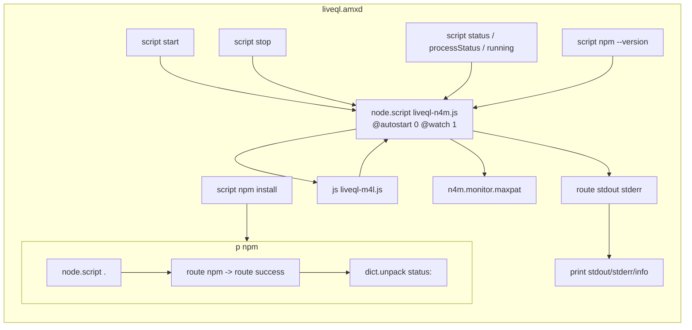
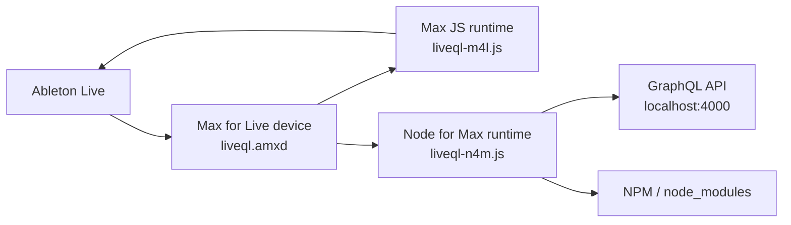

# Max for Live / AMXD Research

Date: 2026-03-18

## Grounded Findings (From Sources)

- `.amxd` is the file type for an “Ableton Live Max Device.” [1]
- Max for Live is an add-on co-developed with Cycling ’74 that lets users create instruments, audio effects, MIDI effects, and MIDI tools in Live. [2]
- Max for Live comes pre-installed with Live Suite (and with Live Standard if the add-on is installed). [2]
- Max devices are not saved inside Live Sets; they exist as separate files. [2]
- Live treats Max for Live devices similarly to sample files; Live Sets reference the AMXD file rather than containing it. [3]
- “Freezing” a Max for Live device consolidates its dependencies into the device so it can be distributed reliably; dependencies can include JavaScript code. [3]
- Max’s search path is the mechanism used to resolve files by name; it looks in the patcher’s folder, the project, and other configured paths. [4]
- Max for Live devices are treated as projects and follow the same search-path rules when locating files. [4]
- JavaScript in Max runs via the `js` object; for Max for Live, the `LiveAPI` object allows JavaScript to communicate with Live’s API. [5]
- Node for Max runs Node.js via the `[node.script]` object, and exposes a `max-api` module that you load with `require("max-api")`. [6]

## Implications For This Repo (Reasoned From Sources)

- If `@liveql.amxd` is **frozen**, the device can contain its JavaScript dependencies internally (freezing explicitly allows JS as a dependency), so the `.js` files do not need to live beside the device on disk. [3]
- If the device is **not frozen**, Max will look for `.js` files using its search path rules (current patcher folder, the associated project, or other configured paths). That suggests the `.amxd` either expects the `.js` files to be nearby or expects them to be in a known Max search path / project location. [4]
- Because Live Sets reference the AMXD file instead of embedding it, the device’s dependencies must be resolvable either inside the AMXD (frozen) or via Max’s search path on the local machine. [2] [3] [4]
- The presence of both `liveql-m4l.js` (Max JS) and `liveql-n4m.js` (Node for Max) aligns with the documented split: `js` for Max’s embedded JS runtime + `node.script` for Node.js with `max-api`. [5] [6]
- The repo’s `package.json` is plausibly used only for the Node for Max side (Node.js runtime), not as a traditional application entry point. This aligns with the Node for Max requirement to load Node modules via `require(...)` inside a `[node.script]` context, but the docs do not specify module install locations or automatic dependency installation. [6]

## AMXD Internals (From Text Dump Provided)

High-level structure in the embedded patcher JSON:

- **Max JS runtime:** `js liveql-m4l.js` is present, with `parameter_enable` disabled. This is the Max JS side that talks to Live via LiveAPI (consistent with the repo’s `liveql-m4l.js`). [5]
- **Node for Max runtime:** `node.script liveql-n4m.js @autostart 0 @watch 1` is present. This indicates a separate Node process for the GraphQL server that does not autostart and will restart on file changes. Node for Max is explicitly designed to run Node.js in a separate process and communicate via `max-api`. [6] [7]
- **Manual lifecycle controls:** The patch includes message boxes for `script start`, `script stop`, `script status`, `script processStatus`, and `script running`, which map directly to `node.script`’s `script` messages (start/stop/status/running/processStatus). [7]
- **NPM hooks:** There are message boxes for `script npm install` and `script npm --version`. The Node for Max `script npm …` message is documented as a wrapper over npm that installs dependencies from `package.json` in the same folder as the Node script argument. [7]
  - In this device, `script npm --version` is sent to `node.script liveql-n4m.js` (so it will check npm relative to that script’s folder).
  - `script npm install` is routed into a subpatcher (`p npm`) that uses `node.script .`, which implies npm is run relative to `.` (the current patcher folder), likely where `package.json` lives when the device is installed.
- **Node stdout/stderr logging:** Node output is routed through `route stdout stderr` and printed to Max (`print stdout`, `print stderr`, `print info`).
- **Monitoring UI:** A bundled bpatcher `n4m.monitor.maxpat` is embedded, which comes from the Node for Max package and is used for status/monitoring.
- **MIDI pass-through:** `midiin` is wired directly to `midiout`, so the device itself does not alter MIDI unless the JS/Node logic does so elsewhere.
- **Dependency cache hints:** The device lists `liveql-m4l.js` in `dependency_cache` with a Windows Ableton User Library path, along with Node for Max debug-monitor assets. There is no explicit `liveql-n4m.js` entry in the cache excerpt you shared.
  - This suggests the device is **not frozen**, and expects JS/Node files to be resolvable via Max’s search path and project rules rather than embedded. [3] [4]

Observed UI text in the patch:

- A comment reads: “Just once, you’ll need to install express.” This matches the presence of the `script npm install` button, but note that the current repo’s `package.json` uses `apollo-server` and `graphql` (not `express` directly), so this may be legacy wording rather than authoritative.

## Diagrams

### AMXD Device Patcher (Internal Wiring)

### AMXD In Relation To Node + Live

## Source Notes

1. Cycling ’74 “File Types” (AMXD is an Ableton Live Max Device).
   https://docs.cycling74.com/userguide/filetypes/
2. Ableton Live 12 Manual “Max for Live” (overview, setup, and device storage behavior).
   https://www.ableton.com/en/manual/max-for-live/
3. Ableton Max for Live Production Guidelines (freezing, dependencies, and AMXD references).
   https://github.com/Ableton/maxdevtools/blob/main/m4l-production-guidelines/m4l-production-guidelines.md
4. Cycling ’74 “Search Path” (file resolution rules; Max for Live devices as projects).
   https://docs.cycling74.com/userguide/search_path/
5. Cycling ’74 “JavaScript Usage” (Max JS + LiveAPI for Max for Live).
   https://docs.cycling74.com/legacy/max8/vignettes/javascript_usage_topic
6. Cycling ’74 “Node for Max API” (Node.js via `node.script`, `max-api` module).
   https://docs.cycling74.com/apiref/nodeformax/
7. Cycling ’74 “node.script” reference (script messages, npm integration, process control).
   https://docs.cycling74.com/reference/node.script/
