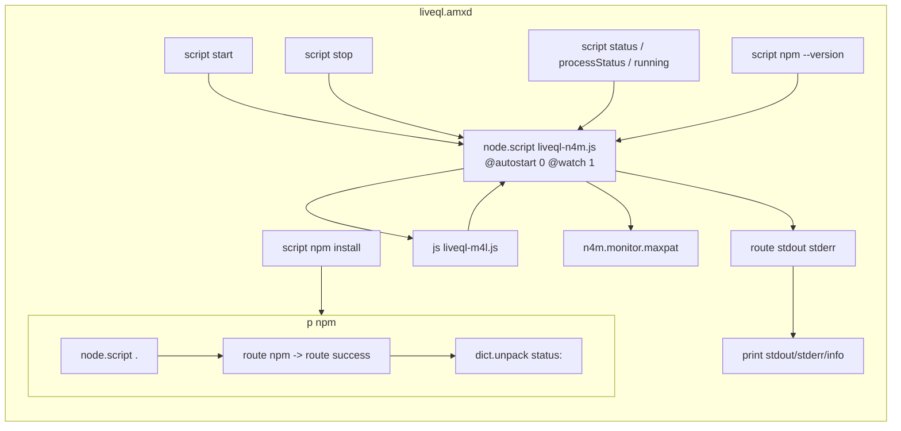
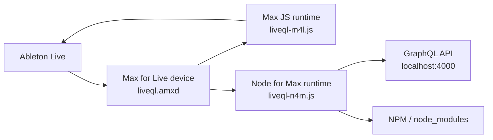

# Max for Live / AMXD Research

Date: 2026-03-18 (updated 2026-03-20)

## Grounded Findings (From Sources)

- `.amxd` is the file type for an “Ableton Live Max Device.” [1]
- Max for Live is an add-on co-developed with Cycling ’74 that lets users create instruments, audio effects, MIDI effects, and MIDI tools in Live. [2]
- Max for Live comes pre-installed with Live Suite (and with Live Standard if the add-on is installed). [2]
- Max devices are not saved inside Live Sets; they exist as separate files. [2]
- Live treats Max for Live devices similarly to sample files; Live Sets reference the AMXD file rather than containing it. [3]
- “Freezing” a Max for Live device consolidates its dependencies into the device so it can be distributed reliably; dependencies can include JavaScript code. [3]
- Max’s search path is the mechanism used to resolve files by name; it looks in the patcher’s folder, the project, and other configured paths. [4]
- Max for Live devices are treated as projects and follow the same search-path rules when locating files. [4]
- JavaScript in Max runs via the `js` object; for Max for Live, the `LiveAPI` object allows JavaScript to communicate with Live’s API. [5]
- Node for Max runs Node.js via the `[node.script]` object, and exposes a `max-api` module that you load with `require("max-api")`. [6]

## Implications For This Repo (Reasoned From Sources)

- If `@liveql.amxd` is **frozen**, the device can contain its JavaScript dependencies internally (freezing explicitly allows JS as a dependency), so the `.js` files do not need to live beside the device on disk. [3]
- If the device is **not frozen**, Max will look for `.js` files using its search path rules (current patcher folder, the associated project, or other configured paths). That suggests the `.amxd` either expects the `.js` files to be nearby or expects them to be in a known Max search path / project location. [4]
- Because Live Sets reference the AMXD file instead of embedding it, the device’s dependencies must be resolvable either inside the AMXD (frozen) or via Max’s search path on the local machine. [2] [3] [4]
- The presence of both `liveql-m4l.js` (Max JS) and `liveql-n4m.js` (Node for Max) aligns with the documented split: `js` for Max’s embedded JS runtime + `node.script` for Node.js with `max-api`. [5] [6]
- The repo’s `package.json` is plausibly used only for the Node for Max side (Node.js runtime), not as a traditional application entry point. This aligns with the Node for Max requirement to load Node modules via `require(...)` inside a `[node.script]` context, but the docs do not specify module install locations or automatic dependency installation. [6]

## AMXD Internals (From Text Dump Provided)

High-level structure in the embedded patcher JSON:

- **Max JS runtime:** `js liveql-m4l.js` is present, with `parameter_enable` disabled. This is the Max JS side that talks to Live via LiveAPI (consistent with the repo’s `liveql-m4l.js`). [5]
- **Node for Max runtime:** `node.script liveql-n4m.js @autostart 0 @watch 1` is present. This indicates a separate Node process for the GraphQL server that does not autostart and will restart on file changes. Node for Max is explicitly designed to run Node.js in a separate process and communicate via `max-api`. [6] [7]
- **Manual lifecycle controls:** The patch includes message boxes for `script start`, `script stop`, `script status`, `script processStatus`, and `script running`, which map directly to `node.script`’s `script` messages (start/stop/status/running/processStatus). [7]
- **NPM hooks:** There are message boxes for `script npm install` and `script npm --version`. The Node for Max `script npm …` message is documented as a wrapper over npm that installs dependencies from `package.json` in the same folder as the Node script argument. [7]
  - In this device, `script npm --version` is sent to `node.script liveql-n4m.js` (so it will check npm relative to that script’s folder).
  - `script npm install` is routed into a subpatcher (`p npm`) that uses `node.script .`, which implies npm is run relative to `.` (the current patcher folder), likely where `package.json` lives when the device is installed.
- **Node stdout/stderr logging:** Node output is routed through `route stdout stderr` and printed to Max (`print stdout`, `print stderr`, `print info`).
- **Monitoring UI:** A bundled bpatcher `n4m.monitor.maxpat` is embedded, which comes from the Node for Max package and is used for status/monitoring.
- **MIDI pass-through:** `midiin` is wired directly to `midiout`, so the device itself does not alter MIDI unless the JS/Node logic does so elsewhere.
- **Dependency cache hints:** The device lists `liveql-m4l.js` in `dependency_cache` with a Windows Ableton User Library path, along with Node for Max debug-monitor assets. There is no explicit `liveql-n4m.js` entry in the cache excerpt you shared.
  - This suggests the device is **not frozen**, and expects JS/Node files to be resolvable via Max’s search path and project rules rather than embedded. [3] [4]

Observed UI text in the patch:

- A comment reads: “Just once, you’ll need to install express.” This matches the presence of the `script npm install` button, but note that the current repo’s `package.json` uses `apollo-server` and `graphql` (not `express` directly), so this may be legacy wording rather than authoritative.

## Node for Max Runtime (From Sources)

### Bundled Node.js Version

Node for Max bundles its own Node.js binary — it does not use the system Node installation. [8]

- **Max 8.0 – 8.5.x**: Bundled Node.js v16.6.0 (EOL September 2023). [9]
- **Max 8.6+**: Updated to Node.js v20.6 (LTS track). [9]
- **Ableton Live 12**: Ships with Max 9, which includes Node v20. [9] [12]
- Node for Max tracks LTS releases of Node.js. [8]
- You can override the bundled binary using `@node_bin_path` and `@npm_bin_path` attributes on `node.script`. Both should be changed together to avoid incompatibilities. [8]

### How `package.json` and `node_modules` Work

- `script npm install` sent to a `node.script` object runs npm **in the same directory as the script file** referenced by the object's first argument. [10]
- `package.json` must be in that same directory. You can generate one with `script npm init`. [10]
- `node_modules` is created next to the script file and `package.json`, not relative to the patcher. [10]
- `package-lock.json` is also generated in that directory. [10]
- `script npm install` (no package name) reinstalls all dependencies from `package-lock.json`, falling back to `package.json` if the lock file doesn't exist. [10]

### Recommended Project Structure

Cycling '74 recommends placing Node content in a dedicated subfolder separate from patchers: [11]

```
Project-Name/
  patchers/
    main.maxpat
  node_content/
    script.js
    package.json
    package-lock.json
    node_modules/
```

**Important:** Disable "Keep Project Folder Organized" in Max project settings — otherwise Max will move `.js` files into `code/` and `.json` files into `data/`, breaking the Node directory structure. [11]

### Distributing `node_modules` in Frozen Devices

- Since Max 8.0.3, Node for Max supports bundling `node_modules` inside frozen Max for Live devices. [11]
- To make this work: place Node files (script, `package.json`, `node_modules`) in a dedicated subfolder, add it to the project's Search Paths with the "Embedded" option enabled, then freeze. [11]
- For non-frozen distribution: ship `.js`, `package.json`, and `package-lock.json`, and have users run `script npm ci` to install dependencies. [11]

## Max Versions and Live Compatibility (From Sources)

| Ableton Live | Bundled Max Version |
|---|---|
| Live 10 | Max 8 |
| Live 11 | Max 8 |
| Live 12 | Max 9 |

- Max 9 is backward-compatible with Max 8 patches — old .amxd devices open without manual migration. [12]
- If a device is saved in Max 9, it may use newer serialization that makes it incompatible with Live 11 (Max 8). [12]
- The Max editor bundled with Live is a limited version, not the full standalone Max application. Standalone Max 9 is a separate purchase from Cycling '74 (Ableton Suite owners get a discount). [12] [13]

## "Keep Project Folder Organized" Setting (From Sources)

This is a **per-project** setting in Max that automatically sorts files into category-based subfolders. **It is ON by default** and **triggers when the project/device is opened**, not just when files are added. Multiple forum reports confirm files are moved every time a project is opened with this setting enabled. [14] [16] [17]

The setting is stored inside the .amxd as `"autoorganize" : 1` in the project JSON. The current `liveql.amxd` has it set to **1 (ON)**.

When enabled, Max creates subfolders in the **project folder** (the folder containing the .amxd on disk) and physically moves files into them based on type:

| Subfolder | File types moved there |
|---|---|
| `patchers/` | `.maxpat`, `.mxt`, `.pat`, `.maxhelp` |
| `code/` | `.js`, `.java`, `.class`, `.lua`, `.glsl`, `.css`, `.xsl` |
| `data/` | `.json`, `.xml`, `.yaml`, `.yml`, `.maxdict`, `.zip` |
| `media/` | audio (`.wav`, `.aif`, `.mp3`), video (`.mov`, `.mp4`), images (`.png`, `.jpg`) |
| `externals/` | `.mxo`, `.mxe`, `.mxe64` |
| `other/` | anything else |

### What this would do to the liveql repo

If `liveql.amxd` is loaded in Live with `autoorganize: 1`, Max would create new directories in the git repo root (`/Users/mw/Documents/src/liveql/`) and move files:

| File | Moved to |
|---|---|
| `liveql-m4l.js` | `code/liveql-m4l.js` |
| `liveql-n4m.js` | `code/liveql-n4m.js` |
| `package.json` | `data/package.json` |

Files are moved, not deleted — but this breaks Node for Max because Node.js requires `package.json`, `.js` files, and `node_modules` to be co-located in the same directory. Once Max scatters `.js` into `code/` and `.json` into `data/`, `require()` resolution and the entire dependency chain break. [11] [14]

### How to safely disable it

Because the setting triggers on load, you must disable it immediately after loading the device, then undo any file moves. The git repo provides a safety net — any moved files can be restored with `git checkout`.

Step-by-step instructions:

1. **Ensure git working tree is clean** — commit or stash any changes so you can restore if Max moves files.
2. **Load the device** — drag `liveql.amxd` from the repo folder into a track in Ableton Live. Max may move `.js`/`.json` files at this point.
3. **Open the Max editor** — click the wrench icon (or right-click the device title bar and select "Open in Max Editor") on the device in Live's device chain.
4. **Open the Project window** — in the Max editor's **bottom toolbar**, click the **"Show Containing Project"** button (folder icon). A separate file-manager-style window opens showing the device's files organized by category.
5. **Open the Project Inspector** — in the Project window's **toolbar**, click the **gear icon**, then select **"Project Inspector"** from the menu.
6. **Disable the setting** — in the Project Inspector dialog, uncheck **"Keep Project Folder Organized"**.
7. **Save the device** — Cmd+S in the Max editor. This persists `"autoorganize" : 0` inside the .amxd.
8. **Restore moved files** — if Max moved files, close the device, then run `git checkout -- .` in the repo to restore the original file layout.
9. **Reload the device** — drag the .amxd in again. This time files will not be moved. [11] [14] [16]

## Development Workflow (Reasoned From Sources)

### Backward Compatibility

Old .amxd files open in Live 12 (Max 9) without manual migration. The .amxd format (binary header + JSON patcher + binary footer) has remained structurally stable across Max versions. Saving in Max 9 writes the current format; there is no explicit "upgrade" step. [12]

### First-Time Setup (One-Time)

Before doing any other development, disable "Keep Project Folder Organized" to prevent Max from rearranging the repo. Follow the step-by-step instructions in the section above. This only needs to be done once — the setting is saved inside the .amxd.

### Editing the Patcher

The .amxd cannot be meaningfully edited outside of Max/Live — the binary header contains checksums that would break if the file were modified externally. [13]

1. **Load the device** — In Ableton Live, drag `liveql.amxd` from the repo folder (`/Users/mw/Documents/src/liveql/`) onto any track. You can drag from Finder, or add the repo folder to Live's browser sidebar under "Places" (right-click in the sidebar → "Add Folder…" → select the repo folder). Do NOT copy or "Save As" to the User Library. [13]
2. **Open the Max editor** — Click the wrench icon on the device in Live's device chain (or right-click the device title bar → "Open in Max Editor"). The Max patcher editor opens, showing the device's visual programming layout. [13]
3. **Edit** — Connect, disconnect, or modify Max objects visually in the patcher.
4. **Toggle edit/performance mode** — Click the lock icon in the Max editor's bottom-left corner (or Cmd+E) to switch between edit mode (unlocked, for modifying the patcher) and performance mode (locked, for interacting with UI elements). [13]
5. **Save** — Cmd+S in the Max editor writes back to the original file location on disk (your git repo). [13]

### Editing JS Files

Edit `liveql-m4l.js` and `liveql-n4m.js` in any text editor or IDE. Because the .amxd is loaded from the same folder as the JS files, Max finds them automatically via the same-folder search path rule. [4]

The `@watch 1` attribute on `node.script` means Max monitors `liveql-n4m.js` for changes and auto-restarts the Node process when the file is saved. No need to manually restart the script after editing. [7]

For `liveql-m4l.js` (Max JS, not Node), changes are picked up when the `js` object is reloaded — either by sending it a `compile` message, toggling the script off/on, or reloading the device.

### Installing Node Dependencies

1. **Open the Max editor** — see step 2 above.
2. **Switch to performance mode** — click the lock icon (bottom-left of Max editor) or press Cmd+E so the patcher is locked. Message boxes are only clickable in performance mode.
3. **Click the `script npm install` message box** in the patcher. This runs npm in the same directory as `liveql-n4m.js`, installing dependencies from `package.json` into a `node_modules/` folder next to the script. [7] [10]
4. **Check output** — npm stdout/stderr is routed to the Max Console. Open the Max Console from the Max editor sidebar (click the console icon, or Window → Max Console) to see install progress and errors. [7]

### Starting the Node Script

1. In the Max editor, switch to **performance mode** (lock icon or Cmd+E).
2. Click the **`script start`** message box in the patcher. This starts the Node process running `liveql-n4m.js`. [7]
3. Check the Max Console for startup logs (e.g., `liveql: loaded the liveql-n4m.js script`).
4. To stop: click **`script stop`**. To check status: click **`script status`** or **`script running`**. [7]

Note: the device has `@autostart 0`, so the Node script does not start automatically when the device loads. You must click `script start` manually. [7]

### Do NOT Freeze During Development

Freezing (snowflake icon in the Max editor toolbar) bundles all dependencies (JS files, `node_modules`, images) into the .amxd itself. This is for distribution only. During development, keep the device unfrozen so it reads files from disk. [3]

### Version Control

- `.amxd` files are mixed binary/JSON — git treats them as binary, so diffs are not human-readable. Track the .amxd for backup, but rely on the `.js` files for meaningful diffs. Treat .amxd changes as whole-file replacements. [15]
- Some developers use external tools for readable Max patch diffs, but this is not standard practice. [15]

## Diagrams

### AMXD Device Patcher (Internal Wiring)



### AMXD In Relation To Node + Live



## Source Notes

1. Cycling ’74 “File Types” (AMXD is an Ableton Live Max Device).
   https://docs.cycling74.com/userguide/filetypes/
2. Ableton Live 12 Manual “Max for Live” (overview, setup, and device storage behavior).
   https://www.ableton.com/en/manual/max-for-live/
3. Ableton Max for Live Production Guidelines (freezing, dependencies, and AMXD references).
   https://github.com/Ableton/maxdevtools/blob/main/m4l-production-guidelines/m4l-production-guidelines.md
4. Cycling ’74 “Search Path” (file resolution rules; Max for Live devices as projects).
   https://docs.cycling74.com/userguide/search_path/
5. Cycling ’74 “JavaScript Usage” (Max JS + LiveAPI for Max for Live).
   https://docs.cycling74.com/legacy/max8/vignettes/javascript_usage_topic
6. Cycling ’74 “Node for Max API” (Node.js via `node.script`, `max-api` module).
   https://docs.cycling74.com/apiref/nodeformax/
7. Cycling ‘74 “node.script” reference (script messages, npm integration, process control).
   https://docs.cycling74.com/reference/node.script/
8. Cycling ‘74 “Node for Max - Custom Binaries” (bundled Node version, LTS tracking, overriding binaries).
   https://docs.cycling74.com/max8/vignettes/09_n4m_custombinaries
9. Cycling ‘74 Forums “Bundled Node.js Version End of Life” (version history: v16 in Max 8.0–8.5, v20 in Max 8.6+).
   https://cycling74.com/forums/bundled-nodejs-version-end-of-life-on-2023-09-11
10. Cycling ‘74 “Node for Max - Using npm” (npm install behavior, package.json location, node_modules).
    https://docs.cycling74.com/max8/vignettes/02_n4m_usingnpm
11. Cycling ‘74 “Node for Max - Working with Projects, Devices and Standalones” (project structure, freezing, bundling node_modules).
    https://docs.cycling74.com/max8/vignettes/03_n4m_projects_devices
12. Ableton “Recommended Max versions” and “Supporting older Live versions with your M4L device” (Live/Max version mapping, backward compatibility).
    https://help.ableton.com/hc/en-us/articles/209772305-Recommended-Max-versions
    https://help.ableton.com/hc/en-us/articles/4406321223186-Supporting-older-Live-versions-with-your-Max-for-Live-device
13. Ableton Live 12 Manual “Max for Live” (editing devices, saving, bundled vs standalone Max).
    https://www.ableton.com/en/manual/max-for-live/
14. Cycling ‘74 “Project Settings” (Keep Project Folder Organized: default on, per-project, file category sorting).
    https://docs.cycling74.com/max8/vignettes/projects_settings
15. Cycling ‘74 Forums (Max for Live and Git, AMXD file format, version control practices).
    https://cycling74.com/forums/max-for-live-and-git
16. Cycling ‘74 Forums "My Max Project appears to delete files when opened" (autoorganize triggers on load, files moved not deleted).
    https://cycling74.com/forums/my-max-project-appears-to-delete-files-when-opened
17. Cycling ‘74 Forums "Stop a project from moving files around" (autoorganize moves files on every project open).
    https://cycling74.com/forums/stop-a-project-from-moving-files-around
