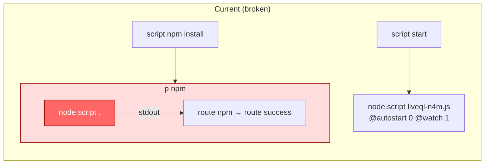
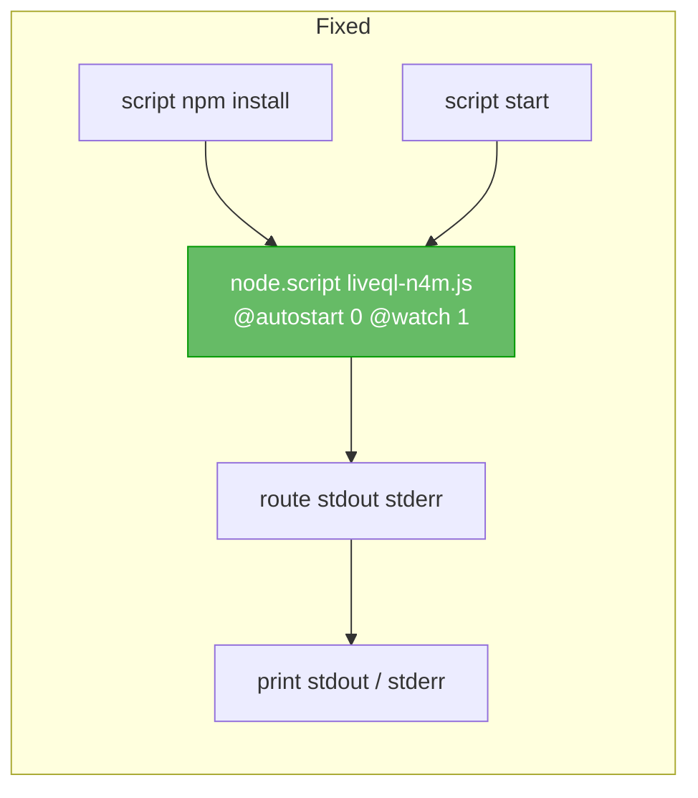

# node.script `.` Error in Max 9 (Live 12)

Date: 2026-03-20

## The Error

When loading `liveql.amxd` in Ableton Live 12 (Max 9), the Max console shows:

```
node.script: can't find file ..js
node.script: no connection to node process manager
```

These errors appear immediately on device load, before any user interaction.

## Root Cause

The device contains two `node.script` objects:

1. **`node.script liveql-n4m.js @autostart 0 @watch 1`** — the main object that runs the GraphQL server. Works correctly.
2. **`node.script .`** — inside the `p npm` subpatcher, wired to the "script npm install" button. This is the source of the errors.

The `node.script .` pattern uses `.` (current directory) as the first argument, treating the directory as an npm package. In Max 8, this resolved `.` through the search path to the patcher's directory, found `package.json`, and used it for npm operations.

**Max 9 changed how `node.script` resolves its first argument.** Instead of recognizing `.` as a directory reference, Max 9 unconditionally appends `.js` to the argument, treating it as a filename stem. This produces `..js` (dot + `.js`), which doesn't exist, causing the `can't find file` error. The `no connection to node process manager` is a secondary failure — the object never initializes, so it never connects.

## Evidence From Max 9 Release Notes

| Version | Relevant Change |
|---------|----------------|
| **9.0.3** | Fix: `.mjs` files are now found by node.script (indicates file resolution rewrite) [1] |
| **9.0.5** | Fix: crash on `script npm install` with no js file (confirms `node.script` without a proper JS argument was crashing, now it errors instead of crashing) [2] |
| **9.1.0** | Node.js updated to v22.18; improved unfreeze behavior for node.script in amxd~ [3] |

The 9.0.3 `.mjs` fix and 9.0.5 crash fix together confirm that Max 9 rewrote the argument resolution logic for `node.script`. The `.` directory-as-package mode appears to be a casualty of this rewrite.

## The `node.script .` Pattern

The pattern is not explicitly documented in official Cycling '74 docs. The Max 8 [Using npm](https://docs.cycling74.com/max8/vignettes/02_n4m_usingnpm) documentation describes sending `script npm install` to a `node.script` object that has a JS file as its argument — not a bare `.`.

A Cycling '74 staff member confirmed that `node.script` resolves arguments through the **Max search path** (a flat namespace), not filesystem-relative paths. [4] This further explains why `.` fails — it's not a meaningful entry in a flat search path.

The documented and supported approach is to send `script npm install` to the same `node.script` object that runs the main script. Since npm runs in the same directory as the script's first argument, and `package.json` is co-located with `liveql-n4m.js`, this works without a separate `node.script .` object.

## Impact

- **Functional impact: none.** The main `node.script liveql-n4m.js` object works correctly. The server starts and runs as expected.
- **The "script npm install" button is broken.** Clicking it produces the same errors because it routes to the broken `node.script .` object.
- **Error on every load.** The `node.script .` object initializes when the device opens, so the error appears even without clicking anything.

## Fix: Route npm install to the main node.script object

The `node.script` docs say `script npm install` runs npm **in the same directory as the script's first argument**. [5] [6] Since `package.json` is co-located with `liveql-n4m.js`, there is no need for a separate `node.script .` object — the main object can handle both running the server AND installing dependencies.

### Current wiring (broken)

The "script npm install" message box routes into a separate `p npm` subpatcher containing its own `node.script .` object. This second object fails to initialize in Max 9.



### Fixed wiring

Delete the `p npm` subpatcher. Wire the "script npm install" message box directly to the main `node.script liveql-n4m.js` object. Both `script start` and `script npm install` go to the same object.



### Steps to apply in the Max editor

1. Open the device in the Max editor (wrench icon).
2. Switch to **edit mode** (Cmd+E or click the lock icon to unlock).
3. Delete the patch cord from the "script npm install" message box to `p npm`.
4. Delete the `p npm` subpatcher object.
5. Draw a new patch cord from the "script npm install" message box **outlet** to the main `node.script liveql-n4m.js` object **inlet**.
6. Save (Cmd+S).

After this change:
- The `..js` error on load is gone (no more `node.script .` object).
- Clicking "script npm install" in performance mode installs dependencies via the main object.
- `script start` continues to work as before.
- npm output routes through the existing `route stdout stderr` → `print` chain.

## Source Notes

1. Cycling '74 Max 9.0.3 Release Notes (node.script .mjs fix).
   https://cycling74.com/releases/max/9.0.3
2. Cycling '74 Max 9.0.5 Release Notes (node.script npm crash fix).
   https://cycling74.com/releases/max/9.0.5
3. Cycling '74 Max 9.1.0 Release Notes (Node.js v22.18, unfreeze improvements).
   https://cycling74.com/releases/max/9.1.0
4. Cycling '74 Forums "node.script with relative path" (search path resolution).
   https://cycling74.com/forums/nodescript-with-relative-path-windows-mac
5. Cycling '74 "Node for Max - Using npm" (documented npm workflow).
   https://docs.cycling74.com/max8/vignettes/02_n4m_usingnpm
6. Cycling '74 "node.script" reference (script messages, npm integration).
   https://docs.cycling74.com/reference/node.script/
